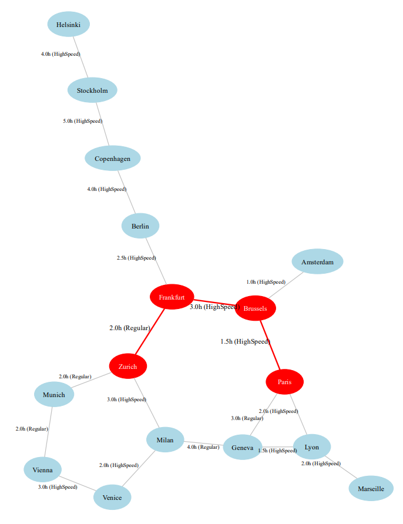

# Railway Pathfinder

This project demonstrates **Dijkstra's shortest path algorithm** on a European rail network.  
It includes:

- CSV-based input for stations and edges.
- Graph visualization using **Graphviz** (PDF output).
- Animated pathfinding using **NetworkX** and **Matplotlib**.

## Features

- Highlight the shortest path in the rail network.
- Animate visited nodes to show how Dijkstra’s algorithm explores the network.
- Fully CSV-driven graph makes it easy to expand with real or synthetic data.

## Example Output

Here is an example of the full rail network graph highlighting the shortest path:

Install dependencies:
pip install graphviz networkx matplotlib
